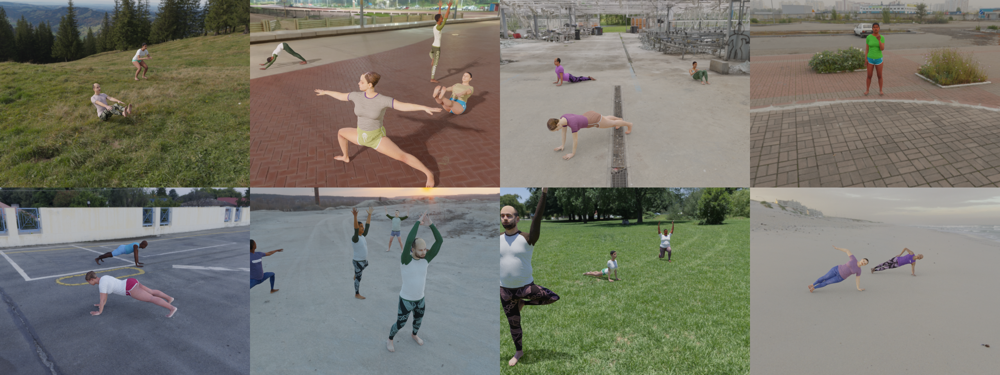
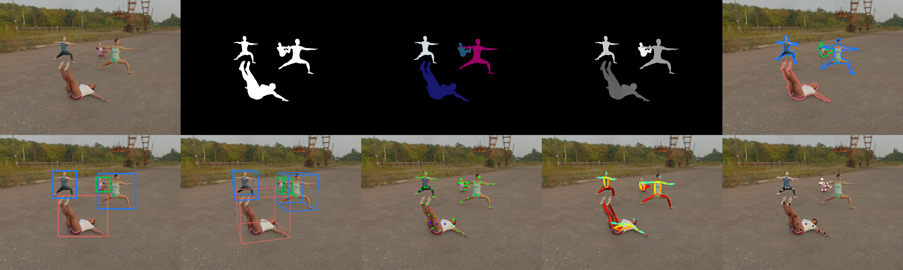

# InfiniteForm: A synthetic, minimal bias dataset for fitness applications



## Abstract 
The growing popularity of remote fitness has increased the demand for highly accurate computer vision models that track human poses. However, the best methods still fail in many real-world fitness scenarios, suggesting that there is a domain gap between current datasets and real-world fitness data. To enable the field to address fitness-specific vision problems, we created InfiniteForm - an open-source synthetic dataset of 60k images with diverse fitness poses (15 categories), both single- and multi-person scenes, and realistic variation in lighting, camera angles, and occlusions. As a synthetic dataset, InfiniteForm offers minimal bias in body shape and skin tone, and provides pixel-perfect labels for standard annotations like 2D keypoints, as well as those that are difficult or impossible for humans to produce like depth and occlusions. In addition, we introduce a novel generative procedure for creating diverse synthetic poses from predefined exercise categories. This generative process can be extended to any application where pose diversity is needed to train robust computer vision models.

Read the full paper [here](https://arxiv.org/abs/2110.01330). 


## Data Download

Images and annotations can be downloaded [here](https://edgeanalytics.us7.list-manage.com/subscribe/post?u=a3101fc4281281b0ade96228e&id=a05ce1fa99). Annotations are provided for the entire dataset in a single [COCO-styled](https://cocodataset.org/#home) json file. RGB images, segmentation maps, and 32-bit depth labels are provided across six `.tgz` files, each roughly 6GB in size.

## Annotations



For each scene, the following data and metadata are provided:

* `{image_id}.rgb.png`: RGB image
* `{image_id}.cseg.png`: semantic segmentation
* `{image_id}.iseg.png`: instance segmentation
* `{image_id}.depth.exr`: 32-bit, unnormalized depth map
* `hdri_name`: name of HDRI file used as background, from [polyhaven.com](https://www.polyhaven.com)
* `hdri_rotation_deg`: z-axis rotation applied to HDRI for render, in degrees
* `camera_rotation_deg`: the yaw orientation of the camera, in degrees

For each avatar, the following labels and metadata are provided:

* `color`: normalized RGB value in the corresponding instance segmentation
* `keypoints`: 2D keypoints in standard COCO format. Keypoints are assigned a visibility of `0`, `1`, or `2`, depending on whether they are [0] not in the image frame, [1] in the image frame but occluded, or [2] visibile.
* `keypoints_3d`: 3D keypoints. The format is the same as `keypoints` but visibility integers are replaced with floats representing absolute depth from camera.
* `num_keypoints`: number of keypoints present in the image (occluded or not)
* `segmentation`: polygon segmentation in standard COCO format
* `area`: area enclosed by polygon segmentation
* `bbox`: bounding box in standard COCO format
* `cuboid_points`: image coordinates of the 3D cuboid surrounding the SMPL-X body model, with axes that are parallel to the global coordinate system. The order of the cuboid points is shown below.

```
   3-------2
  /|      /|
 / |     / |
0-------1  |
|  7----|--6
| /     | /
4-------5
```

* `pose_variation`: name of the pose variation (e.g. "sideplank_right")
* `pose_category`: name of the pose category (e.g. "sideplank")
* `exercise_category`: name of the exercise category. This is either "HIIT" (high-intesity interval training) or "Yoga".

* `zaxis_rotation_deg`: rotation of the avatar along the z-axis, in degrees
* `attire_top`/`attire_bottom`: clothing type used in the applied UV texture
* `presenting_gender`: gender of the underlying SMPL-X body model
* `waist_circumference`: circumference of the SMPL-X body model's waist, in meters
* `height`: height of the SMPL-X body model in a T-pose, in meters
* `betas`: 10 shape coefficients for the underlying SMPL-X body model

We note that nose and ear keypoints are not included, since they are not explicitly represented in the SMPL-X body model. We feel this is an acceptable trade-off since these keypoints are unlikely to be significant for fitness applications. Because SMPL-X hip joints reflect the skeleton’s true rotation point and not the surface location typically annotated by humans, these keypoints were also adjusted in 3D space to better reflect their placement in COCO. 

## Looking for something different? 
Do you want additional exercise poses? Different camera angles? New labels? More clothing variety? Or any other changes?   
Get in touch! We can generate data to fit your exact needs. 

Contact email: [info@toinfinity.ai](mailto:info@toinfinity.ai)


## Terms and Conditions

This work is licensed under a
[Creative Commons Attribution 4.0 International License](http://creativecommons.org/licenses/by/4.0/).
